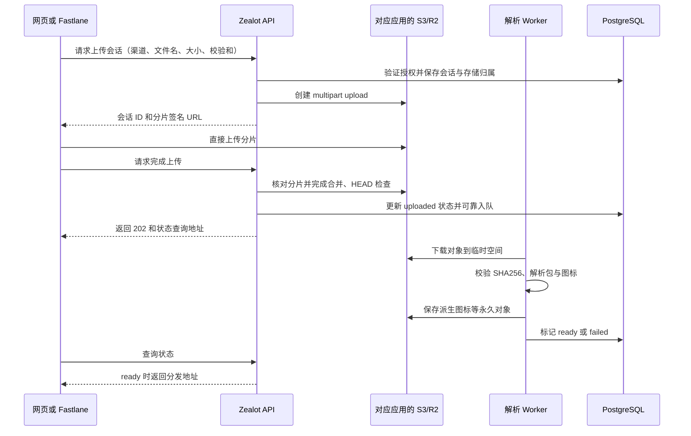

# Zealot 直传 S3、应用分组权限及多存储绑定可行性报告

> 2026-09-07 上线范围调整：用户明确 `infra.s3.mockdata.work` 用于公开下载安装包并保持启用。管理、上传和应用页面仍校验权限；R2 公开对象地址不要求登录，撤销成员权限不会使已知公开地址失效。下文私有下载/签名撤权规则仅适用于未配置公开域名的私有存储。用户随后要求暂不考虑备份，本次不配置生产远程备份；已实现的备份/恢复能力保留。证书续期与有效签名 IPA 真机安装仍按原约定暂缓。

日期：2026-09-07。评估基线：本 fork `feature/s3-storage`，提交 `524a0d64`，基于 Zealot 6.2.2。

本报告依据当前源码和云厂商官方文档编写，是设计评估，不代表下述功能已经实现。本次仅产出报告，不修改线上服务。

## 1. 结论与范围

| 需求 | 结论 | 主要工作 |
|---|---|---|
| 客户端直传 S3，分析时再从 S3 下载 | 可行，R2 可支持 | 新增上传会话、分片直传、完成确认、异步解析；改造网页及 Fastlane 客户端 |
| 不再备份应用服务器文件卷 | 可行，有恢复前提 | 永久文件全部对象化，任务状态和对象索引入库；保留外部密钥和可重建部署配置 |
| 应用分组、用户按分组或应用授权 | 可行，现有协作者机制可复用 | 新增分组成员关系，统一页面、API、下载和后台任务的权限检查 |
| 分组或应用绑定不同 S3 | 可行，需要更换全局存储配置模型 | 存储配置持久化、继承规则、对象逐条绑定存储、历史文件迁移 |

建议三项使用同一套数据模型实施：**先建立权限与存储归属，再实现直传，最后完成无本地持久文件的恢复演练。** 不建议先做一版只支持全局 Bucket 的直传再返工。

“只备份数据库”的准确交付口径应为：**应用服务器丢失后，可以用数据库备份、仍然存在的对象存储、外部恢复密钥和版本化部署配置恢复，无须备份 uploads、缓存或日志卷。** 如果连对象存储也丢失，数据库不能重建 APK/IPA；这一点无法通过改代码保证。

## 2. 当前系统实际能力

| 当前证据 | 对本次改造的影响 |
|---|---|
| [API 上传控制器](../app/controllers/api/apps/upload_controller.rb) 的 `set_parser` 读取 `params[:file].path` | 上传请求必须先带完整文件，不能只提交 S3 地址 |
| [S3 适配器](../lib/zealot/storage/s3.rb) 从 ENV 读取唯一 Bucket、Endpoint、凭据 | 当前是全站单一存储，不能在并发请求中通过修改 ENV 切桶 |
| [ApplicationUploader](../app/uploaders/application_uploader.rb)、[解析任务](../app/jobs/teardown_job.rb) 已支持临时下载远程文件 | 可以复用远程解析能力，但仍要补解析状态、重试和对象引用 |
| [schema](../db/schema.rb)、[Collaborator](../app/models/collaborator.rb) 已有 `apps_users` 和应用角色 | “用户限定应用”并非完全没有基础；当前缺少应用之上的分组实体 |
| [AppsController](../app/controllers/apps_controller.rb)、[API AppsController](../app/controllers/api/apps_controller.rb) 已有部分按用户过滤的列表 | 不能据此认定整个系统都已严格隔离 |
| [ApplicationPolicy](../app/policies/application_policy.rb) 等 Scope 返回 `all`；[ReleasePolicy](../app/policies/release_policy.rb) 的 `show?` 返回 true；[AppsHelper](../app/helpers/apps_helper.rb) 下载条件接受任意已登录用户 | 必须统一权限，不能只在首页隐藏应用 |
| [UserRoles](../app/models/concerns/user_roles.rb) 将全局 developer 也视为管理者 | 新模型下需要明确迁移规则，避免普通开发者拥有全站访问能力 |
| [备份模块](../lib/zealot/backup/uploads.rb) 仍支持拉取全部远程文件并打包，最终归档依赖本地路径 | 不符合目标中的默认“数据库备份即可”，备份任务和管理页面也需要调整 |
| [GoodJob 配置](../config/initializers/good_job.rb) 为应用内异步执行、未自动重试未处理错误；任务和 Solid Cache 表已在 PostgreSQL | 不必引入 Redis，但要给新任务增加持久状态、重试与对账；建议可独立启动解析 worker |

## 3. 直传与异步解析设计

目标流量：

### 3.1 建议新增协议

| 操作（路径为建议） | 行为 |
|---|---|
| `POST /api/upload_sessions` | 检查用户是否可向目标渠道上传，解析存储继承，生成随机对象 key；接受幂等键 |
| `POST /api/upload_sessions/:id/parts` | 按需签发限定 part number 的短期 URL，支持断点续传和续签 |
| `POST /api/upload_sessions/:id/complete` | 再次检查授权与应用状态；服务端核对分片并完成上传，返回 202 |
| `GET /api/upload_sessions/:id` | 返回进度、解析结果或可重试错误，限制为该会话所属权限范围 |
| `DELETE /api/upload_sessions/:id` | 取消会话并中止 multipart upload，幂等处理 |

小文件也可作为单分片 multipart 上传，减少两套完成语义；大文件多分片并发上传。初期可采用保守的 16–64 MiB 分片、3–4 路并发，实际按文件大小和厂商限制调整，不作为固定性能承诺。

**推荐由服务端独占 CompleteMultipartUpload 权限。** 客户端仅获得 UploadPart URL，不获得最终对象的 PutObject 或 Complete 权限。已完成的对象不再接受该上传会话的分片写入，从设计上避免“解析完成后客户端重用签名覆盖原文件”。最终对象使用随机 UUID，禁止按文件名或版本号覆盖。

如果另提供单次预签名 PUT 快速通道，应上传到隔离的 staging key，并由服务端通过条件复制冻结到未授权客户端写入的最终 key；不能把“调用 complete 接口”当成撤销 PUT 签名。预签名 URL 在到期前可以重复使用。[Cloudflare 说明](https://developers.cloudflare.com/r2/api/s3/presigned-urls/)

### 3.2 正确性和故障恢复

建议状态：`initiated → uploading → uploaded → verifying → parsing → ready`，并有 `failed / cancelled / expired`。上传字节成功与发布可下载必须区分；未达到 ready 不出现在最新版本、正常下载、SDK 更新检查和安装页中。

服务端应检查真实对象大小、格式、bundle/application ID 与目标渠道匹配情况；流式计算 SHA256，不能把 multipart ETag 当成完整文件哈希。客户端提供的名称、大小和校验和均作为待验证声明。针对解析执行时间、解压大小、临时磁盘和并发设上限。

数据库事务不能原子提交 S3 操作：complete 使用数据库行锁/幂等键；云端已合并但数据库写入失败时，通过预先保存的对象位置 HEAD 对账恢复。发布记录与待执行任务在数据库中可靠关联，补偿任务定期发现 uploaded/parsing 卡住会话。worker 重启后可重新下载并处理；图标 key、元数据和 webhook 事件应具备去重能力。

解析失败保留错误和可重试状态，不直接吞异常后标记成功。孤立对象、过期分片和失败解析文件分别设清理规则，不能误删数据库备份仍可能引用的正式对象。上传用户被撤权或应用被移动时，完成和发布阶段重新检查权限；会话锁定原始存储位置，不能临时切到另一 Bucket。

### 3.3 网页与 Fastlane

网页改为“申请会话—直传—轮询解析结果”，展示上传进度、解析中、失败重试。浏览器跨域需要 Bucket CORS，限定站点来源、PUT/GET/HEAD 等所需方法，并暴露客户端需要读取的 ETag 等响应头；CLI/Fastlane 不受浏览器 CORS 限制。[R2 CORS](https://developers.cloudflare.com/r2/buckets/cors/)

[官方 Fastlane 插件](https://github.com/tryzealot/fastlane-plugin-zealot)现在提交完整安装包，不能靠修改 endpoint 自动变成直传。建议扩展插件的 `direct_upload` 模式，支持分片重试、状态等待和原有返回变量。CI 中“上传完成”和“解析完成”的超时分别配置；默认等待 ready 后成功退出，failed 时退出失败。网页/API 的 dSYM、Proguard 等调试文件使用相同直传协议，避免遗漏大文件入口。

旧上传接口可在迁移期保留，但明确它仍中转文件；新流程验收后默认直传，设置旧入口的退役时间，不能宣称旧插件已经绕过 frp。

直传消除的是客户端到 Zealot 的安装包中转。解析 worker 仍需读取完整文件，部署在内网时这段速度受其到对象存储的网络影响；可以在网络更好的云主机运行 worker。因此不能承诺“字节上传成功就立即可安装”。

## 4. 分组与访问权限

### 4.1 推荐默认规则

增加 `Group` 在 App 之上：`Group → App → Scheme → Channel → Release`。默认每个应用属于一个分组，已有应用迁入“未分组”。分组可容纳多个应用；多级分组、多分组归属不在这版估算内，因为它们需要额外定义权限及存储冲突规则，可后续扩展。

复用应用协作者关系，新增分组成员角色。建议权限为正向授权：用户有效权限取分组授权与应用直接授权的并集；没有授权即不可见。需要特别保密的应用可关闭“继承分组成员”，仅接受应用直接授权。仅有某个应用授权的用户不能因此看到同组其他应用，必要时仅显示分组名作为导航。

| 身份 | 查看/下载 | 上传/重试解析 | 管理成员和应用设置 | 管理存储凭据 |
|---|---|---|---|---|
| 平台管理员 | 全部 | 全部 | 全部 | 可以 |
| 分组管理员 | 本组继承权限的应用 | 同左 | 本组范围，不能提高自己的平台权限 | 可选择平台授予本组的存储，不显示密钥 |
| 应用管理员 | 本应用 | 本应用 | 本应用 | 可选择授权存储，不显示密钥 |
| 开发者 | 授权范围 | 授权范围 | 不默认允许成员管理 | 不允许 |
| 查看者 | 授权范围 | 不允许 | 不允许 | 不允许 |
| 未授权用户/访客 | 默认禁止 | 禁止 | 禁止 | 禁止 |

共享渠道密码仅可作为明确开放的分发链接机制，不能越过私有应用权限。默认关闭匿名访问；若业务需要外部分享，应使用单独的可撤销、可过期分享记录，并明确它是授予访问能力。

当前全局 developer 的宽权限不能直接沿用。上线前导出旧角色与协作者清单，将开发权限映射到指定应用/分组，展示权限差异，禁止静默扩大权限。平台管理员仍明确拥有跨组访问权。

### 4.2 必须统一的入口

采用共享的 `visible_apps(user)` 和 `can?(user, action, app)`，让 Pundit Scope、控制器、序列化器和签名服务都使用它。必须覆盖：列表、搜索、仪表盘数量与最近上传、应用详情、渠道版本查询、下载两级路由、图标、二维码、iOS manifest、调试文件、解析详情、API/SDK、webhook 配置与任务结果。ID、slug、channel_key 或已登录状态本身均不能代替授权。

原始 SQL/关联查询不能依赖页面是否显示按钮。签发下载 URL 前再次校验权限，权限相关缓存按用户和权限版本隔离，成员变动后使旧缓存失效。管理接口应恢复并审计适当的 CSRF 防护；当前 ApplicationController 有全局跳过配置，浏览器管理与 token API 需分开处理。

iOS 无浏览器会话的安装清单使用短期 ticket；应绑定应用、版本和授权版本，撤权后禁止新签名。已发出的 R2 下载 URL 是短期 bearer 凭据，到期前可能继续使用；已下载文件更无法追回。要求即时撤销每次下载需增加边缘鉴权层，会改变当前纯 S3 直连方案，报告默认接受短期有效窗口。

CI 使用专门服务账号/可限定应用的 token；兼容旧用户 token 时仍按该用户的有效应用权限检查，绝不能把 channel_key 当上传凭据。

## 5. 多 S3 配置与归属

### 5.1 推荐数据模型

| 新增/调整实体 | 关键内容 |
|---|---|
| `groups`、`group_memberships` | 分组、成员角色、权限版本 |
| `apps` | group_id、是否继承成员权限、可选 storage_profile_id |
| `storage_profiles` | 名称、提供商、region、Endpoint、download endpoint、Bucket、prefix、path-style、状态、授权使用范围 |
| 存储配置版本/凭据 | 位置配置版本化；访问密钥加密保存，凭据轮换与对象位置变更区分 |
| `stored_objects` | 配置版本 ID、完整 key、字节数、SHA256、对象类型、所属应用、状态、软删除及保留时间 |
| `upload_sessions`、分片记录 | 用户/渠道、固定存储版本、对象引用、multipart ID、幂等键、状态及过期时间 |
| Release / DebugFile | 关联包/图标/调试对象；解析状态与错误；保留原字段完成渐进迁移 |
| 审计事件、删除/迁移任务 | 成员变更、存储绑定、对象迁移、恢复和删除的可追踪记录 |

新上传的存储选择优先级：**应用显式绑定 → 分组默认绑定 → 系统默认绑定**。服务端作选择；客户端不能提交任意 profile ID 或 key 越权写入。使用某个存储不等于拥有查看这个存储中其他应用的权限。

例：分组 A 默认 R2-1，应用 A1 继承；A2 覆盖为 AWS-S3-2；分组 B 默认 R2-3。允许多个 profile 指向同一账户不同 Bucket，也允许跨账户、跨提供商。

### 5.2 历史文件必须固定原位置

每个正式对象记录自己所属的存储配置版本和完整 key，不能每次下载按应用“当前默认存储”推导。应用改组或改绑定，只影响之后创建的上传会话；已有版本、图标、调试文件仍从原位置读写删除。派生图标默认跟随源包绑定的存储，以免后台任务期间配置变更导致跨桶混用。

Endpoint/Bucket/prefix 变更创建新位置版本，保留旧引用；密钥轮换可更新该位置的可用凭据，不应迫使迁移所有对象。profile 被引用时不可直接删除；停用新上传和禁止历史读取应是两个不同操作。

现有 ENV 单桶配置导入为默认 profile。根据现有 CarrierWave 路径回填存储对象引用，抽样/全量核对 HEAD 后才切换读取逻辑；避免重新上传全部历史文件。AppFileUploader、AppIconUploader、DebugFileUploader 均要使用对象绑定，不能只改上传控制器。

历史迁移是单独任务：复制 → 校验目标字节 → 原子切换对象引用 → 保留旧对象到恢复窗口结束 → 延迟清理。失败不改变原引用。跨厂商复制通常需要迁移 worker 中转流式读取；不能假设 R2 可以用 CopyObject 直接读取另一家 S3。

多个账户必须使用各自的客户端实例，缓存键包含 profile/配置版本/凭据版本；禁止改变全局 ENV 或全局 CarrierWave 配置切桶，以免并发串用凭据。自定义 Endpoint 仅由可信管理员配置，校验协议和允许的目标，避免任意网络请求及密钥外送。

## 6. “只备份数据库”的实现边界

| 内容 | 永久存放位置 | 服务器文件卷需要备份吗 |
|---|---|---|
| APK、IPA、其他安装包、图标、dSYM/Proguard | 各应用绑定的对象存储 | 不需要；对象本身必须保留 |
| 用户、角色、分组、版本、解析结果、对象映射、上传状态、审计及任务状态 | PostgreSQL | 需要数据库备份 |
| 缓存、解析临时文件、分片客户端状态副本 | 可清理空间，权威状态在 DB/S3 | 不需要，可丢弃并重试 |
| 运行日志 | stdout/外部日志系统；需要保留的业务审计入库 | 不需要备份本地日志卷 |
| 数据库备份归档 | 独立备份目标/备份存储 | 生成时可临时落盘，完成后移走，不依赖本机 backup 卷 |
| S3 凭据密文 | DB 或外部密钥服务 | DB 方案仍需要外部主密钥解密 |
| Rails SECRET_KEY_BASE、加密主密钥、恢复访问凭据 | 密钥管理器/密码库等独立恢复来源 | 必须保管；不能丢失后指望 DB 自行解密 |
| 镜像、Compose、frp/反代配置、Bucket/CORS/保留策略 | 镜像仓库、版本库或可重复部署配置 | 需要可重建，不应只留在故障主机 |

备份程序默认只导出 PostgreSQL，不再下载整个 Bucket；数据库归档可存入专用备份 profile，与业务应用存储绑定分开。恢复归档的访问凭据必须能在数据库尚未恢复时获取，避免循环依赖。

还必须修改现有“删除 release 即删除对象”的行为：采用软删除及独立对象删除队列，正式对象保留时间应大于数据库可回退窗口及恢复缓冲。恢复旧数据库时，其引用对象仍存在；启动后先禁止 GC 和业务副作用，进行对象对账，再恢复定时任务。恢复后缓存可以清空，旧通知不能重复发送，卡住的上传会话按云端真实状态重建。

R2 的 S3 兼容表并不提供完整的 AWS 版本控制/复制能力，不能直接承诺“打开 S3 Versioning 就解决”。R2 有自己的 Bucket lock 保留机制，需结合正式对象前缀和清理政策设计，避免把临时上传也永久锁住。[S3 兼容表](https://developers.cloudflare.com/r2/api/s3/api/)、[R2 Bucket locks](https://developers.cloudflare.com/r2/buckets/bucket-locks/)

若要求抵御 Bucket 被删除、账户失效或云端对象损毁，需要独立对象副本/另一账户存储；这超出“仅备份 DB 就能应对所有灾难”的字面要求。建议接受“不备份服务器文件卷”的口径，另行明确对象保留或副本策略。

## 7. 改造顺序、投入与性能

以下是基于源码评估的工程估算，不是交付承诺。假设一名熟悉 Rails、S3 和 Fastlane 的开发者，包含网页功能、测试和迁移；不新增多级分组、不重做整套 UI、不做自建跨云复制平台。

| 阶段 | 可验收产出 | 估算人日 |
|---|---|---:|
| A. 统一模型与迁移底座 | 分组、存储配置、对象引用、旧数据回填设计 | 4–6 |
| B. 分组与权限 | 分组/成员管理、统一鉴权、越权测试 | 6–9 |
| C. 直传协议与客户端 | 分片会话、异步解析、网页及 Fastlane、恢复重试 | 8–12 |
| D. 多存储与无本地文件恢复 | 绑定界面、历史对象归属、删除保留、DB-only 备份 | 4–6 |
| E. 联调、迁移演练及上线 | 两套存储隔离、兼容性、回滚、文档 | 5–7 |
| 合计 | 功能与验证 | 27–40 |

建议预留约 20% 风险余量，总计约 33–48 人日，单人约 7–10 个工作周。历史文件数量、第三方 S3 兼容性及现有客户端数量会改变估算。先在测试环境验证协议和权限，再决定正式排期。

性能收益是上传大文件绕开 frp、Web 不必接收安装包正文、解析可独立伸缩。对象读取、分片请求、失败重试、派生文件、保留期旧对象及跨厂商迁移仍产生资源消耗；无流量规模前不提供费用数字或倍数提速承诺。

## 8. 完整验收清单

1. 网页与 Fastlane 的 APK/IPA/调试文件上传主体只到 S3，Zealot 仅接收控制请求；断网续传、签名过期、取消、重复完成均可恢复且不生成重复版本。
2. 对大小、SHA256、应用标识不匹配，以及压缩包解析失败给出失败状态；重启 worker 后能重试，无误报 ready。
3. 已完成上传不能通过旧分片 URL 改写正式包；不同用户不能完成或取消他人的会话；撤权后不能发布或取得新下载签名。
4. 分组 A/B 的普通用户，对列表、搜索、统计、版本、API/SDK、下载、图标、二维码、manifest 和调试文件都无越权；直接输入 ID/slug/channel_key 也不泄露内容。
5. 同一进程并发向两个 profile 上传，包、图标、解析、下载、删除均落在各自位置；应用改组、改默认绑定后旧版本仍可访问。
6. 凭据轮换不中断历史引用；被引用存储不能误删；跨存储迁移中断后源对象继续可用，校验完成才切换。
7. 删除测试环境应用容器及全部本地非 DB 卷，在新主机用数据库备份、对象存储和外部密钥恢复，版本列表、包、图标、调试文件均可访问；中途上传状态可恢复或明确终止。
8. 将数据库回退到一个对象删除之前的备份点，确认保留窗口内的原包仍能下载；恢复期间垃圾回收不会破坏旧数据。
9. R2 必须实测；第二套独立存储验证绑定隔离。宣称支持 AWS/OSS 时，分别完成目标提供商的协议测试，不能以 MinIO 通过代替全部厂商验证。
10. 验证 iOS 安装清单的授权和签名续期；真实安装另用有效签名与可信 HTTPS 的 IPA 测试，不能把 fixture 下载成功等同真机安装成功。

## 9. 建议采用的默认决策

单层分组、应用单一归组；默认私有；应用继承分组权限并可关闭继承；应用存储覆盖分组存储；旧对象不随绑定自动移动；正式包不可覆盖；统一 multipart 直传；解析成功才发布；数据库与对象保留窗口联动；密钥独立保管。

这些是建议的产品规则，尚未改变现有部署。需要调整其中任一规则时，应先同步修改权限矩阵、恢复条件和工作量估算。
